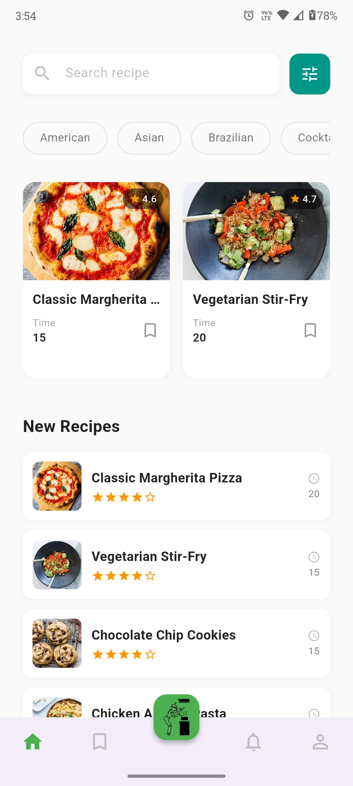
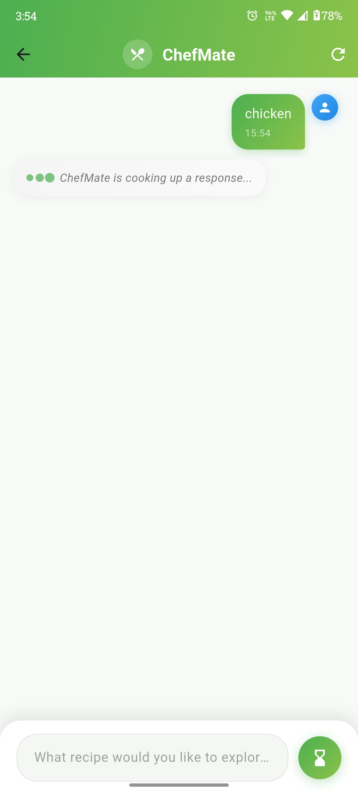
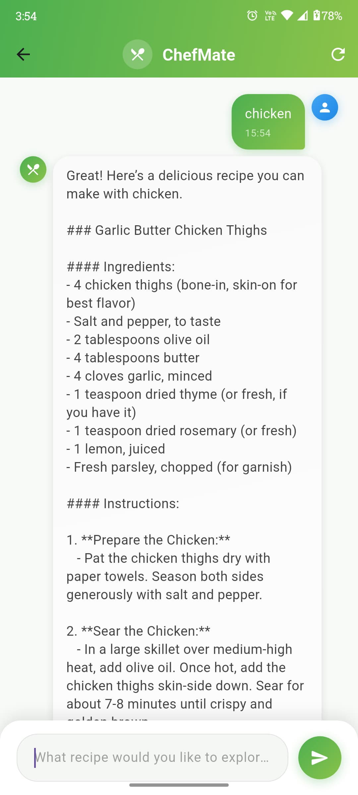

# 👨‍🍳 ChefMate – Your AI-Powered Kitchen Companion 🍽️

ChefMate is an intelligent recipe generator built with **Flutter** and powered by **ChatGPT**. Just enter the ingredients you have at home, and ChefMate will whip up a personalized recipe for you – like having a chef in your pocket!

---

## 🚀 Features

- ✅ **Ingredient-Based Recipe Generator** – Input your ingredients and get a complete recipe in seconds.
- 🧠 **AI Integration** – Uses ChatGPT (OpenAI API) to generate intelligent cooking suggestions.
- 📋 **Clean & Modern UI** – Designed with Flutter to deliver a smooth, user-friendly experience.
- 🍛 **Dummy JSON Integration** – Simulated recipe data for a realistic and structured display.

---

## 📸 Screenshots

| Home Screen | Ingredient Input |
|-------------|------------------|
|  |  |

| Recipe Output | AI Prompt Screen |
|----------------|------------------|
|  |

> 📂 Place screenshots inside a `screenshots/` folder in the root of the project.

---

## 🧰 Tech Stack

- **Flutter** – Cross-platform UI framework
- **Dart** – Language for building the app
- **OpenAI GPT (ChatGPT)** – Backend AI engine
- **DummyJSON** – Sample structured recipe data

---

## ⚙️ Setup & Run

1. Clone the repository:
   ```bash
   git clone https://github.com/yourusername/chefmate.git
   cd chefmate
